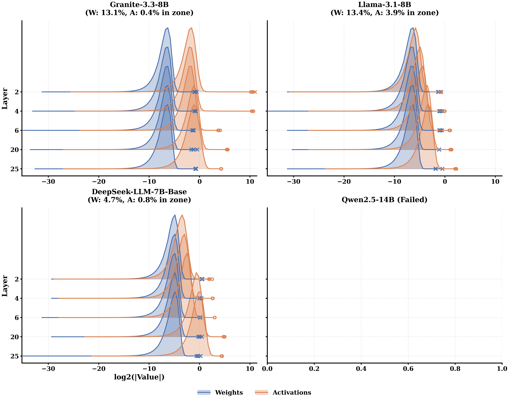
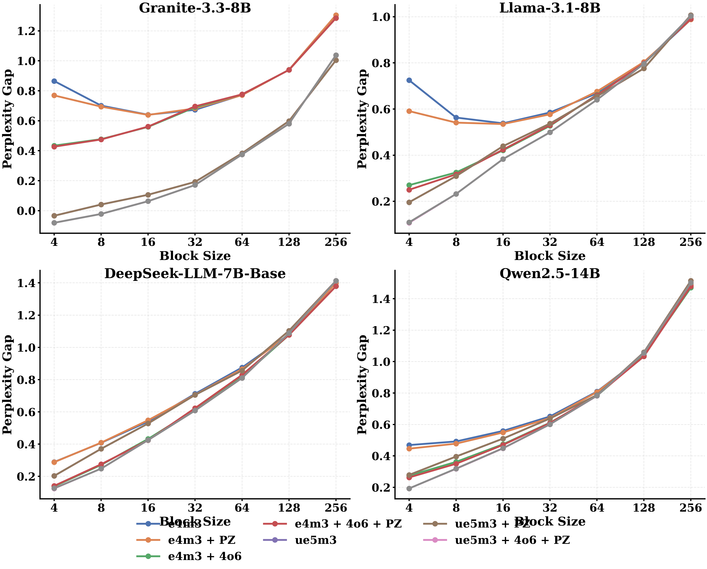

# Finer is Better: NVFP4 Quantization Evaluation

This directory contains our consolidated codebase for evaluating baseline perplexity and custom NVFP4 quantization with microscaling on large language models, intended to reproduce findings from paper 2601.19026.

This file is intended to be fully self-explanatory. Follow the steps below to set up the environment and run experiments.

## Setup

To set up the environment on a new machine or VM, follow these steps exactly:

1.  **Create and Activate Virtual Environment**:
    Run these commands in your terminal to create a new Python virtual environment and install the required packages:
    ```bash
    python3 -m venv ~/quant_eval_venv
    source ~/quant_eval_venv/bin/activate
    pip install --upgrade pip
    pip install torch transformers datasets tqdm pandas tabulate
    ```

2.  **Clone and Install Paper\'s Repository**:
    Run these commands to clone the paper\'s repository and install the `mx` package in editable mode. This adds support for the fast CUDA operations!
    ```bash
    git clone https://github.com/iclr2016codeshare/microscaling ~/MX-QLLM
    cd ~/MX-QLLM/microxcaling
    pip install -e .
    cd ~
    ```

## How to Run

### Baseline Perplexity Evaluation
To calculate the baseline perplexity (WikiText-2) for a model without any quantization applied, use this command:
```bash
python3 nvfp4_eval.py <model_id>
```

**Examples for our 4 target models:**
- **Llama 3.1 8B**: `python3 nvfp4_eval.py meta-llama/Llama-3.1-8B`
- **Granite 3.3 8B**: `python3 nvfp4_eval.py ibm-granite/granite-3.3-8b-base`
- **Qwen 2.5 14B**: `python3 nvfp4_eval.py Qwen/Qwen2.5-14B`
- **DeepSeek 7B**: `python3 nvfp4_eval.py deepseek-ai/deepseek-llm-7b-base`

### Quantized Perplexity Evaluation
To run the evaluation with NVFP4 element quantization and simulated FP8 scales for a specific microscale block size, use this command:
```bash
python3 nvfp4_eval.py <model_id> <block_size>
```

**Examples:**
- `python3 nvfp4_eval.py meta-llama/Llama-3.1-8B 4`
- `python3 nvfp4_eval.py Qwen/Qwen2.5-14B 16`

## Custom Modifications

We have implemented several custom modifications to the standard FP4 quantization scheme to improve precision and handle edge cases. They are controlled by arguments to `torch_eval.py`:

`python3 torch_eval.py <model_id> <block_sizes> [prevent_zero] [four_over_six] [use_ue5m3] [num_steps] [csv_suffix]`

1.  **Prevent Zero (PZ)**: Refuses to round scales to absolute zero, bounding them at a minimum value of $2^{-9}$. This prevents extreme degradation in models sensitive to small weights (like Qwen).
    *   **Activation**: Pass `true` as the 3rd argument (default: `true`).
2.  **Four Over Six (4o6)**: Dynamically selects between scaling by 4 or 6 based on which one minimizes Mean Squared Error (MSE) for each block.
    *   **Activation**: Pass `true` as the 4th argument (default: `false`).
3.  **UE5M3**: Uses a custom unsigned 8-bit floating point format for scales with 5 exponent bits and 3 mantissa bits, allowing a wider range than standard FP8.
    *   **Activation**: Pass `true` as the 5th argument (default: `false`).

## Distribution Analysis

To understand why certain models (like Qwen) are sensitive to quantization, we extracted the weight and activation distributions for several layers and plotted them as log-scale overlapping histograms (Ridge Plots).

### Qwen vs Granite Distributions



## Running Tests

To run unit tests for logic in this directory:
```bash
python3 test_nvfp4.py
```

## Results

This section is automatically updated by the evaluation script after each run. Do not edit manually.

<!-- RESULTS_START -->

### Granite

|                  |   Baseline |   BS=4 |   BS=8 |   BS=16 |   BS=32 |   BS=64 |   BS=128 |   BS=256 |
|:-----------------|-----------:|-------:|-------:|--------:|--------:|--------:|---------:|---------:|
| e4m3             |       4.91 |   0.86 |   0.7  |    0.64 |    0.67 |    0.77 |     0.94 |     1.3  |
| e4m3 + PZ        |       4.91 |   0.77 |   0.69 |    0.64 |    0.68 |    0.77 |     0.94 |     1.3  |
| e4m3 + 4o6       |       4.91 |   0.43 |   0.48 |    0.56 |    0.69 |    0.78 |     0.94 |     1.28 |
| e4m3 + 4o6 + PZ  |       4.91 |   0.43 |   0.47 |    0.56 |    0.7  |    0.78 |     0.94 |     1.28 |
| ue5m3            |       4.91 |  -0.03 |   0.04 |    0.11 |    0.19 |    0.38 |     0.6  |     1    |
| ue5m3 + PZ       |       4.91 |  -0.03 |   0.04 |    0.11 |    0.19 |    0.38 |     0.6  |     1    |
| ue5m3 + 4o6 + PZ |       4.91 |  -0.08 |  -0.02 |    0.06 |    0.17 |    0.38 |     0.58 |     1.04 |
| ue5m3 + 4o6      |       4.91 |  -0.08 |  -0.02 |    0.06 |    0.17 |    0.38 |     0.58 |     1.04 |

### Llama

|                  |   Baseline |   BS=4 |   BS=8 |   BS=16 |   BS=32 |   BS=64 |   BS=128 |   BS=256 |
|:-----------------|-----------:|-------:|-------:|--------:|--------:|--------:|---------:|---------:|
| e4m3             |       6.33 |   0.72 |   0.56 |    0.54 |    0.58 |    0.67 |     0.8  |     0.99 |
| e4m3 + PZ        |       6.33 |   0.59 |   0.54 |    0.54 |    0.58 |    0.68 |     0.8  |     0.99 |
| e4m3 + 4o6       |       6.33 |   0.27 |   0.33 |    0.42 |    0.53 |    0.66 |     0.8  |     0.99 |
| e4m3 + 4o6 + PZ  |       6.33 |   0.25 |   0.32 |    0.42 |    0.53 |    0.66 |     0.8  |     0.99 |
| ue5m3            |       6.33 |   0.2  |   0.31 |    0.44 |    0.54 |    0.66 |     0.78 |     1.01 |
| ue5m3 + PZ       |       6.33 |   0.2  |   0.31 |    0.44 |    0.54 |    0.66 |     0.78 |     1.01 |
| ue5m3 + 4o6 + PZ |       6.33 |   0.11 |   0.23 |    0.38 |    0.5  |    0.64 |     0.8  |     1    |
| ue5m3 + 4o6      |       6.33 |   0.11 |   0.23 |    0.38 |    0.5  |    0.64 |     0.8  |     1    |

### DeepSeek

|                  |   Baseline |   BS=4 |   BS=8 |   BS=16 |   BS=32 |   BS=64 |   BS=128 |   BS=256 |
|:-----------------|-----------:|-------:|-------:|--------:|--------:|--------:|---------:|---------:|
| e4m3             |      12.39 |   0.29 |   0.41 |    0.54 |    0.71 |    0.88 |     1.08 |     1.4  |
| e4m3 + PZ        |      12.39 |   0.29 |   0.41 |    0.55 |    0.71 |    0.86 |     1.08 |     1.4  |
| e4m3 + 4o6       |      12.39 |   0.14 |   0.27 |    0.43 |    0.61 |    0.82 |     1.08 |     1.38 |
| e4m3 + 4o6 + PZ  |      12.39 |   0.14 |   0.28 |    0.42 |    0.62 |    0.83 |     1.08 |     1.38 |
| ue5m3            |      12.39 |   0.2  |   0.37 |    0.53 |    0.7  |    0.86 |     1.1  |     1.41 |
| ue5m3 + PZ       |      12.39 |   0.2  |   0.37 |    0.53 |    0.7  |    0.86 |     1.1  |     1.41 |
| ue5m3 + 4o6 + PZ |      12.39 |   0.12 |   0.25 |    0.42 |    0.61 |    0.81 |     1.09 |     1.41 |
| ue5m3 + 4o6      |      12.39 |   0.13 |   0.25 |    0.42 |    0.61 |    0.81 |     1.09 |     1.41 |

### Qwen

|                  |   Baseline |   BS=4 |   BS=8 |   BS=16 |   BS=32 |   BS=64 |   BS=128 |   BS=256 |
|:-----------------|-----------:|-------:|-------:|--------:|--------:|--------:|---------:|---------:|
| e4m3             |       5.36 |   0.47 |   0.49 |    0.56 |    0.65 |    0.81 |     1.04 |     1.49 |
| e4m3 + PZ        |       5.36 |   0.45 |   0.48 |    0.55 |    0.64 |    0.81 |     1.04 |     1.49 |
| e4m3 + 4o6       |       5.36 |   0.27 |   0.36 |    0.47 |    0.61 |    0.78 |     1.04 |     1.47 |
| e4m3 + 4o6 + PZ  |       5.36 |   0.26 |   0.35 |    0.47 |    0.61 |    0.79 |     1.03 |     1.48 |
| ue5m3            |       5.36 |   0.28 |   0.4  |    0.51 |    0.64 |    0.79 |     1.06 |     1.51 |
| ue5m3 + PZ       |       5.36 |   0.28 |   0.4  |    0.51 |    0.64 |    0.79 |     1.06 |     1.51 |
| ue5m3 + 4o6 + PZ |       5.36 |   0.19 |   0.32 |    0.45 |    0.6  |    0.78 |     1.05 |     1.5  |
| ue5m3 + 4o6      |       5.36 |   0.19 |   0.32 |    0.45 |    0.6  |    0.78 |     1.06 |     1.5  |

### Perplexity Gap All Models



<!-- RESULTS_END -->
